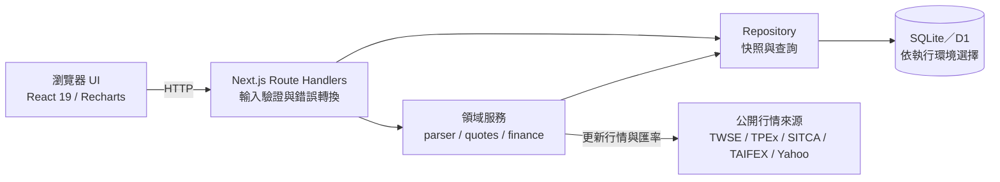
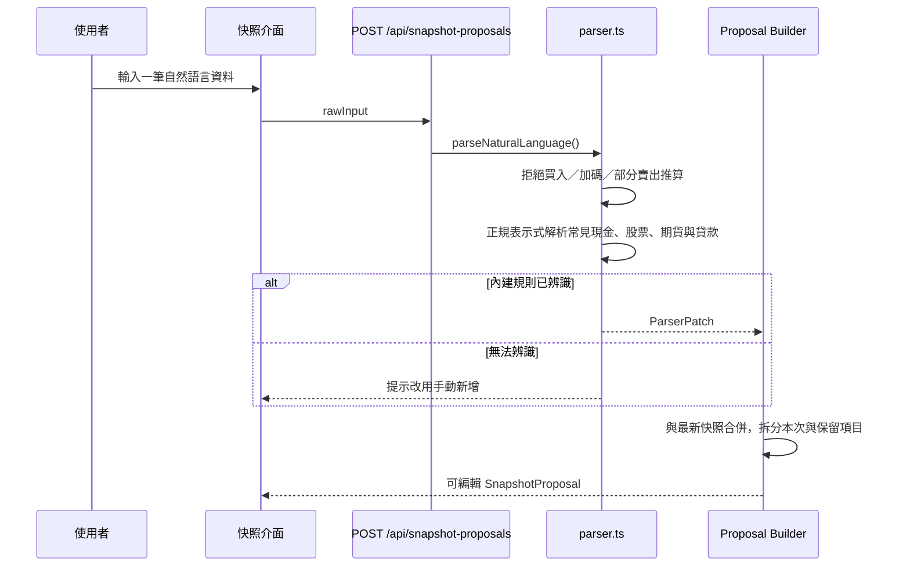
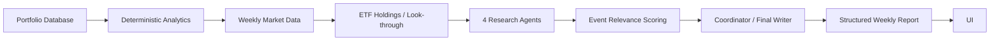
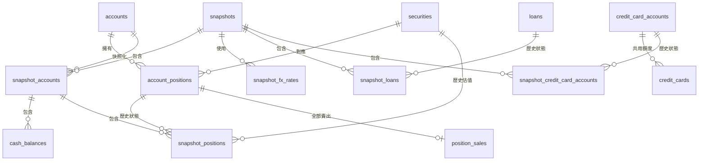

# FinanceReview

資料存取層可在本機使用 SQLite，或在 Cloudflare Workers 使用 D1。正式環境已部署於 `finance.hsun.dev`，並由 Cloudflare Access 保護；指令、架構與部署流程請見 [Workers＋D1 說明](app/WORKERS.md)。

FinanceReview 是具備帳號審核與資料隔離的資產歷史工具。本機模式只監聽 `127.0.0.1`，資料保存在 `data/finance-review.db`；Workers 模式將相同資料模型保存在 D1。每個登入信箱各自擁有私人帳本，新帳號必須經管理員永久核准後才能存取。


## 主要功能

- 使用者以 Email OTP 自行登入後須填寫申請理由，送出後才進入待審核名單；管理員可記錄內部備註、核准、拒絕或停用，未核准者只能查看使用固定假資料的唯讀正式介面。
- 以時間快照追蹤現金、股票、ETF、基金、期貨、貸款、總資產與淨值。
- 以銀行共用額度群組追蹤信用卡總應繳金額、繳款狀態、額度使用比例、剩餘分期與溢繳，並呈現每月總應繳及實際繳款走勢。
- 使用內建規則將常見的自然語言輸入整理成可編輯的確認表，並提供完整手動輸入。
- 更新臺灣上市櫃、美股、基金、期貨行情及外幣匯率，失敗時可人工補價。
- 顯示整體、帳戶及個別標的的歷史走勢與未實現損益。
- 將每次快照的外部投入、提領、收益與費稅拆分成淨值變動歸因。
- 完整結算持倉全部賣出，將淨入帳加入指定帳戶並保存已實現損益。
- 排除外部投入與提領後估算投資績效、年化報酬與最大回撤，並和臺灣加權指數、SPY 或 VT 比較。
- 啟動時顯示資料更新時效，並檢查總額、行情、匯率、貸款還款與期貨契約月份。
- 透過 JSON 匯出／匯入備份，並可在畫面上暫時隱藏財務數字；日期與最後更新時間可依使用者選擇的時區顯示。
- 提供私人「研究」工作區：追蹤台美股自選標的與 K 線，並集中檢視 AI 每週研究報告。
- 每位使用者可自行設定 OpenAI API Key、報告語言與投資背景；每週日產生台美股研究週報，亦可手動產生並保留歷次結果。

## 啟動

必要環境：

- Windows PowerShell
- Node.js 24 LTS（含 npm）

在 PowerShell 執行：

```powershell
.\Start-FinanceReview.ps1
```

第一次啟動會安裝套件，接著開啟 `http://127.0.0.1:3000`；SQLite 會在首次讀取時自動初始化。文字整理完全由應用程式內建規則處理，不需額外模型或 Gateway。

可指定連接埠或停用自動開啟瀏覽器：

```powershell
.\Start-FinanceReview.ps1 -Port 3100
.\Start-FinanceReview.ps1 -NoBrowser
```

## 使用方式

1. 按「新增快照」，每次只輸入一筆帳戶餘額或持倉資料；例如先輸入「永豐銀行 30652」，再輸入「永豐銀行日幣 60000」。
2. 按「整理成確認表」後只會顯示本次相關帳戶；未顯示的既有帳戶會在保存完整快照時原樣保留。整理成功後輸入框會自動清空，失敗則保留內容並顯示原因。
3. 更新行情與匯率，確認所有人工價格後保存。
4. 若本次餘額變動包含投入、提領、收益或費稅，可在確認表加入本期資金流，讓系統拆分淨值變動來源。
5. 要結束持倉時按「全部賣出」，確認成交價、入帳帳戶、手續費與交易稅；系統會更新現金並計算已實現損益。
6. 在「信用卡帳單」建立發卡銀行的共用額度群組、每月繳款期限與實體卡片；之後可只選擇本次要更新的銀行，填寫繳款日期、總應繳金額及實際繳款金額，其他銀行會沿用上一份快照。剩餘分期本金與銀行顯示的溢繳餘額為選填。

信用卡採快照模式，不追蹤即時消費或未出帳金額，也不需要連結發卡銀行的存款帳戶。繳款期限日期由帳戶設定的「每月繳款期限（日）」自動推算，不需每月重複輸入；系統會在下一期期限前 7 天提醒尚未更新的信用卡帳戶。總應繳金額為零的帳單在當期顯示為「已繳」，進入下一個繳款月份後才改為「待更新」。額度使用比例以「總應繳金額 ÷ 共用信用額度」計算；全額繳清且沒有分期時不列負債，部分未繳與尚未列入帳單的剩餘分期本金列入負債，超額溢繳則列為信用卡溢繳資產。更新信用卡資料不會自動修改任何銀行現金餘額。

銀行與現金帳戶只記錄現金餘額；券商帳戶可同時記錄現金、股票、ETF、基金與期貨。一般基金使用投信投顧公會淨值，上市 ETF 依所屬市場取得行情；小型臺指期可依契約月份取得臺灣期貨交易所每日行情。

期貨輸入範例：

```text
元大期貨帳戶權益30萬，小型臺指期 2026/09 多單2口，均價22150
```

期貨帳戶權益會計入總資產；系統另外計算未實現損益並顯示參考名目價值，但不會把契約名目價值重複加入總資產。
小型臺指期會使用 `MTX` 與每點 50 元；微型臺指期會使用 `TMF` 與每點 10 元。每點價值可在確認表中調整，行情尚未更新時也可先用均價估值並保存。
新增期貨持倉時，先輸入契約代碼（例如券商的 `TMZ6`，或期交所查價格式 `TMF202612`），系統會辨識微型／小型臺指期、到期月份與每點價值，並使用 `TMFYYYYMM`／`MTXYYYYMM` 查詢行情。接著確認月份與多空方向，再填口數和進場均價。其他期貨可輸入完整代碼，並自行填寫名稱與每點價值。

全部賣出會在同一個資料庫交易內建立一份不含該持倉的新快照、將淨入帳加入指定帳戶、保存成本基礎及已實現損益。一般證券的淨入帳為成交總額減手續費與交易稅；期貨則以結算損益扣除費稅後調整現金。部分賣出仍請在新快照填寫目前剩餘數量與平均成本。

資金流只用於說明已反映在帳戶餘額中的變動，不會再次加減現金。系統將資產變動拆成外部投入、外部提領、股息／利息、費稅、其他流入／流出，以及扣除這些項目後的市場與匯率等變動；負債減少則由相鄰快照自動計算。

投資績效使用快照間的資產總額與外部投入／提領，以資金流發生於期間中點估算資金流調整報酬。基準比較會取得 Yahoo Finance 歷史行情；美元基準另換算為 TWD。資料更新狀態在 45 天內顯示綠色、46 至 179 天顯示黃色，180 天以上顯示紅色並在開啟應用時警告。

## 系統架構

FinanceReview 是單一 Next.js 應用程式，瀏覽器透過 Route Handlers 使用業務邏輯、文字解析、行情與資料存取功能。本機由 Node.js runtime 寫入 SQLite；Cloudflare 版本由 vinext 建置成 Worker，並透過 binding 寫入 D1。



### 應用程式分層

| 層級     | 主要位置                                                           | 職責                                                     |
| -------- | ------------------------------------------------------------------ | -------------------------------------------------------- |
| 表現層   | `app/components/`、`app/app/page.tsx`                              | 財務總覽、圖表、快照確認表、手動輸入、行情補價與備份操作 |
| HTTP API | `app/app/api/`                                                     | 接收 JSON、以 Zod 驗證輸入、呼叫領域服務並統一回傳錯誤   |
| 領域邏輯 | `app/lib/parser.ts`、`finance.ts`、`quotes.ts`、`quote-refresh.ts` | 文字解析、快照提案合併、Decimal 計算、行情與匯率解析     |
| 資料存取 | `app/lib/repository.ts`、`db.ts`                                   | SQLite／D1、原子寫入、快照與趨勢查詢、備份匯入匯出       |
| 共用契約 | `app/lib/types.ts`、`validation.ts`                                | TypeScript 型別與 API 結構驗證                           |

### 規則式自然語言解析

自然語言處理僅使用確定性規則，不會呼叫 AI 模型或將輸入送到外部服務：



解析設計重點：

- `parser.ts` 辨識常見的帳戶餘額、臺／美股、基金代碼、臺指期貨與貸款語句。
- 規則解析結果不會直接寫入資料庫；使用者仍需在確認表檢查並主動保存。
- `buildProposal()` 會以帳戶名稱、機構與帳戶識別碼比對最新快照，將本次項目與未變動的 `preservedAccounts`／`preservedLoans` 分開，避免局部更新刪除其他資產。
- 買入、加碼及部分賣出不由系統推算數量或成本；系統會要求改填「目前數量與平均成本」。只有明確的全部賣出才進入賣出流程。
- 無法以內建規則辨識時，原始輸入會保留，使用者可改用手動表單。

文字整理完全由應用程式內的規則執行；行情更新會連線至下述公開資料來源。

### 快照與行情資料流

建立快照時，`POST /api/snapshots` 先以 Zod 驗證確認表，補齊外幣對 TWD 的匯率，再由 repository 原子寫入完整快照與選填資金流。本機 SQLite 使用 `BEGIN IMMEDIATE`，D1 使用 `D1Database.batch()`。金額計算使用 `decimal.js`，資料庫則以十進位字串保存金額，避免 JavaScript 浮點數直接成為財務資料來源。

「更新全部行情」分成兩階段：

1. `POST /api/quotes/refresh` 讀取最新快照、取得行情，並回傳待確認資料及失敗項目，不立即寫入。
2. 使用者補齊失敗價格後，`PUT /api/quotes/refresh` 會確認 `baseSnapshotId` 仍是最新快照，再建立新快照，避免在畫面資料過期時覆蓋較新的狀態。

行情來源如下：

| 市場／資料         | 來源                                               | 備援方式           |
| ------------------ | -------------------------------------------------- | ------------------ |
| 臺灣上市股票與 ETF | 臺灣證券交易所 OpenAPI                             | 最近快照／人工價格 |
| 臺灣上櫃股票與 ETF | 證券櫃檯買賣中心 OpenAPI                           | 最近快照／人工價格 |
| 美股               | `yahoo-finance2`                                   | 最近快照／人工價格 |
| 一般基金           | 投信投顧公會淨值；有指定代碼時亦可查 Yahoo Finance | 平均成本／人工淨值 |
| 小型、微型臺指期   | 臺灣期貨交易所每日行情                             | 平均成本／人工價格 |
| 外幣匯率           | Yahoo Finance                                      | 最近快照／人工匯率 |

`quote_cache` 保存可重新取得的行情以減少重複請求；它不包含在 JSON 備份中。

### 研究週報與 API Key

「設定」頁面的「報告設定」提供繁體中文、英文、日文選項，以及投資目標、期限、風險承受度與 API Key 管理。行情面板不需要 API Key；產生週報時會提示先前往設定頁儲存金鑰。正式環境每週日 07:00（台灣時間）自動產生一份，手動按鈕則每按一次另存一份。

週報依序呈現 `Portfolio Snapshot`、本週市場、`Portfolio Attribution`、`Portfolio Risk`、個股重要事件、下週觀察與 `Data Quality`。沒有有效內容的歸因、風險、事件、觀察或資料品質區段不顯示。超過單次上限的自選標的會先依關聯標的的持倉占比由高到低排序，優先省略低占比與未持有標的；同占比才沿用既有順序。省略筆數只留在報告證據供除錯，不會成為一般使用者的 `Data Quality` 內容。

週報管線保留既有四個研究 Agent 與最終撰稿者，不增加 Agent 數量；可確定計算的數學則由應用程式完成：



- `Weekly Performance` 使用結構化日行情，以「前一交易週最後收盤至本交易週最後收盤」計算 QQQ、SPY、臺灣加權指數與 0050；不會將自選清單的單日漲跌當成週報酬。市場報酬、資金流調整後的投資組合估算報酬與任兩次快照的變動會分開表達。
- 週報畫面將確定性證據轉成市場與資產類型占比圓環圖、前十大持倉加「其他」的水平長條圖、Portfolio 與市場基準的週績效比較圖、正負歸因圖、底層標的穿透曝險及 ETF 重疊圖；圖表缺少有效資料時不顯示。市場與持倉權重均標示為「證券部位內占比」，不與現金或淨值占比混用。圓環圖 tooltip 會同時顯示分類名稱與三位小數占比。
- `Portfolio Attribution` 只在週初、週末快照為相鄰快照且間隔 3～10 天時產生，並用期初權重乘上標的週報酬估算貢獻；資料不足時回傳空陣列並省略區段。
- ETF 穿透目前辨識 QQQ、VOO、0050、006208 與 TQQQ。Agent 只取得具日期與來源的成分資料，應用程式計算直接／間接底層曝險、ETF 重疊及主要重複持股。TQQQ 以三倍「每日目標名目曝險」表示，並保留每日重設、路徑相依、波動耗損與複利差異警語；不視為長期固定三倍曝險。
- 個股事件只保留實際持有的股票，排除 ETF 與基金，依持倉權重由高到低排列；同權重時再比較事件關聯分數，每檔最多保留兩則並取全體前五則。下週事件也會依持倉關聯與事件類別排序後取前五則。
- 外部研究來源以結構化物件保存；正文只能引用 `[sourceId]`，畫面再依已驗證的來源物件建立連結。模型產生的 Markdown 連結及裸網址會被移除，避免錯誤或串接網址。
- `Data Quality` 最多顯示五項會影響解讀的限制，不顯示省略筆數、重試、Agent 執行或其他內部狀態。投資背景未填齊時仍可產生集中度、地域、ETF 重疊、穿透與槓桿等描述性風險，但不會產生個人化配置或交易建議。

送至 OpenAI 的資料僅有自選標的、公開行情、從最新快照計算的股票／ETF／基金持倉比例，以及使用者填寫的投資背景；不包含結構化的帳戶餘額、持倉數量或金額。投資背景未填齊時仍會整理市場，但不輸出個人化買賣方向。報告記錄產生時的語言、資料期間與使用的證據；AI 建議包含依據、觸發條件與風險，並不會自動下單。OpenAI API 的費用由使用者金鑰所屬帳戶承擔。

使用者金鑰在伺服器端以 AES-GCM 加密後保存，不會回傳至瀏覽器或包含在 JSON 備份。管理員必須先設定 32 位元組的 Base64 `RESEARCH_KEY_ENCRYPTION_KEY`：本機放在 `app/.env.local`，Workers 放在對應環境的 Cloudflare Secret。金鑰需持續保管；遺失後既有加密的使用者金鑰無法解密，使用者必須重新設定。備份還原後也需重新設定 API Key。部署方式見 [Workers＋D1 說明](app/WORKERS.md)。

### SQLite 與 D1 資料庫

本機預設資料庫為 `data/finance-review.db`，使用 Node.js 內建的 `node:sqlite` `DatabaseSync`。連線啟用 foreign keys、WAL journal mode 與 5 秒 busy timeout，並依 `PRAGMA user_version` 自動執行 `app/db/migrations/`。Workers 透過 `DB` binding 使用 D1，初始 schema 位於 `app/d1/migrations/`。目前 schema version 為 16。

資料模型同時保留「主檔／生命週期」與「不可變的時間切片」：



| 資料表                          | 用途                                                                   |
| ------------------------------- | ---------------------------------------------------------------------- |
| `accounts`                      | 帳戶主檔；保存名稱、機構、類型與選用識別碼                             |
| `securities`                    | 標的主檔；以市場與代碼識別股票、ETF、基金或期貨                        |
| `account_positions`             | 帳戶與標的之間的持倉生命週期，區分 `active`／`sold`                    |
| `loans`                         | 貸款主檔；不隨快照變動的識別資訊                                       |
| `snapshots`                     | 每次記錄的時間、來源文字、前一快照及彙總金額                           |
| `snapshot_accounts`             | 快照當下的帳戶名稱、類型與排序                                         |
| `cash_balances`                 | 各快照帳戶、各幣別的現金及 TWD 換算值                                  |
| `snapshot_positions`            | 持倉數量、成本、行情、匯率、現值與未實現損益的時間切片                 |
| `snapshot_loans`                | 未償本金、利率、月付金、還款日與 TWD 負債值的時間切片                  |
| `credit_card_accounts`          | 發卡銀行、共用額度、結帳日及每月繳款期限等信用卡帳戶主檔               |
| `credit_cards`                  | 所屬額度群組、卡片名稱、末四碼、卡別與主附卡狀態                       |
| `snapshot_credit_card_accounts` | 上期帳單、實際繳款、分期、溢繳、使用比例及淨負債的時間切片             |
| `snapshot_cash_flows`           | 快照期間的外部投入、提領、收益、費稅及其他調整，供變動歸因使用         |
| `snapshot_fx_rates`             | 該快照實際使用的匯率、日期、來源與人工覆寫狀態                         |
| `position_sales`                | 全部賣出的日期、數量、成交價、入帳帳戶、費稅、成本、淨入帳與已實現損益 |
| `quote_cache`                   | 可重新取得的行情快取，不列入備份                                       |
| `app_settings`                  | 基準幣別、預設圖表區間與行情提供者等設定                               |
| `watchlist_items`               | 台美股自選標的、持有狀態、加入來源與追蹤開關                           |
| `research_notes`                | 舊版人工研究資料，僅為既有備份與資料相容性保留                         |
| `research_note_revisions`       | 舊版人工研究修訂，僅為既有備份與資料相容性保留                         |
| `research_note_sources`         | 舊版人工研究來源，僅為既有備份與資料相容性保留                         |
| `research_quote_snapshots`      | 舊版人工研究行情快照，僅為既有備份與資料相容性保留                     |
| `research_todos`                | 舊版研究待辦，僅為既有備份與資料相容性保留                             |
| `research_preferences`          | 每位使用者的報告語言與投資背景                                         |
| `research_credentials`          | 每位使用者的加密 OpenAI API Key；不列入 JSON 備份                      |
| `weekly_research_reports`       | 已生成週報、語言、期間與當次使用的非金額證據                           |

刪除快照會受外鍵關係保護；快照內容使用 `ON DELETE CASCADE` 清理，主檔與持倉生命週期則多採 `RESTRICT`，避免歷史參照失效。建立快照、全部賣出與匯入備份等重要寫入在兩種資料庫都會原子提交，失敗時整批 rollback。

### API 一覽

| Method                | Route                               | 用途                                 |
| --------------------- | ----------------------------------- | ------------------------------------ |
| `GET`                 | `/api/dashboard`                    | 最新快照、歷史、淨值趨勢與已售出部位 |
| `GET`／`POST`         | `/api/snapshots`                    | 列出或建立快照                       |
| `GET`／`DELETE`       | `/api/snapshots/:id`                | 讀取或刪除單一快照                   |
| `POST`                | `/api/snapshot-proposals`           | 將自然語言轉成待確認提案             |
| `POST`                | `/api/quotes/resolve`               | 解析確認表中的行情與匯率             |
| `POST`／`PUT`         | `/api/quotes/refresh`               | 預覽全部行情更新／確認建立新快照     |
| `POST`                | `/api/positions/:id/sell`           | 全部賣出並建立結果快照               |
| `GET`                 | `/api/trends/accounts/:id`          | 帳戶歷史走勢                         |
| `GET`                 | `/api/trends/securities/:id`        | 標的數量、成本與市值走勢             |
| `GET`                 | `/api/performance`                  | 投資績效、最大回撤與基準比較         |
| `GET`／`POST`         | `/api/backup`                       | 匯出或合併匯入 JSON 備份             |
| `GET`／`POST`         | `/api/watchlist`                    | 查詢或新增自選標的                   |
| `PATCH`／`DELETE`     | `/api/watchlist/:id`                | 啟用、停用或隱藏自選標的             |
| `GET`                 | `/api/watchlist/:id/candles`        | 取得自選標的 K 線                    |
| `POST`                | `/api/watchlist/refresh`            | 更新自選行情快取                     |
| `GET`／`POST`         | `/api/research-notes`               | 舊版研究報告相容 API                 |
| `GET`／`PUT`／`PATCH` | `/api/research-notes/:id`           | 舊版研究報告相容 API                 |
| `GET`                 | `/api/research-notes/:id/revisions` | 舊版研究修訂相容 API                 |
| `GET`／`POST`         | `/api/research-todos`               | 舊版研究待辦相容 API                 |
| `PATCH`               | `/api/research-todos/:id`           | 舊版研究待辦相容 API                 |
| `GET`／`PUT`          | `/api/research-preferences`         | 讀取或更新語言與投資背景             |
| `PUT`／`DELETE`       | `/api/research-preferences/key`     | 設定、更換或刪除個人 API Key         |
| `GET`／`POST`         | `/api/weekly-reports`               | 列出或手動產生每週研究報告           |
| `GET`                 | `/api/weekly-reports/:id`           | 讀取單份每週研究報告                 |

## 資料位置與環境變數

本機模式的預設資料庫位置：

```text
data/finance-review.db
```

| 變數                         | 用途                                              |
| ---------------------------- | ------------------------------------------------- |
| `FINANCE_REVIEW_DB_PATH`     | 覆寫 SQLite 資料庫路徑                            |
| `NEXT_DIST_DIR`              | 覆寫 Next.js 建置輸出目錄                         |
| `APP_DEPLOYMENT_ENVIRONMENT` | 指定版本標示的環境；正式部署會自動設為 production |
| `APP_BUILD_TIME`             | 覆寫版本標示使用的 ISO 8601 建置時間              |

每頁日期與最後更新時間會依「設定」頁儲存在瀏覽器的時區偏好顯示；研究報告語言則由「報告設定」統一管理。旁邊另列目前環境、`package.json` 版本及七碼 Git commit。GitHub Actions 會從 `GITHUB_SHA` 自動帶入部署版本，滑鼠停留可查看建置時間。

Workers 模式由 `wrangler.jsonc` 的 `DB` binding 連接 D1。請勿將資料庫或匯出的財務備份提交至版本控制。SQLite 原始資料未加密，應搭配作業系統帳戶權限及磁碟加密保護。

## 專案結構

```text
FinanceReview/
├─ app/                       # Next.js 應用程式
│  ├─ app/                    # 頁面與 Route Handlers
│  ├─ components/             # 財務總覽、確認表與互動元件
│  ├─ db/migrations/          # SQLite schema migrations
│  ├─ d1/migrations/          # D1 初始 schema migration
│  ├─ e2e/                    # Playwright 端對端測試
│  ├─ lib/                    # 解析、行情、估值與 repository
│  ├─ scripts/                # 資料庫初始化、D1 產生與 Workers 驗證
│  └─ tests/                  # Vitest 單元／整合測試
├─ data/                      # 本機 SQLite 資料
└─ Start-FinanceReview.ps1    # Windows 一鍵啟動腳本
```

## 手動開發

```powershell
cd app
npm ci
npm run db:init
npm run dev
```

主要技術為 Next.js 16、React 19、TypeScript、Node.js 內建 SQLite、Cloudflare Workers＋D1、vinext、Decimal.js、Recharts、Zod、Vitest 與 Playwright。

## 開發驗證

```powershell
cd app
npm run check
npm run test:e2e
npm run check:workers
```

`npm run check` 會依序執行型別檢查、ESLint、Vitest 與正式建置。提交前亦可用
`npm run format:check` 檢查格式；需要套用 Prettier 時再執行 `npm run format`，避免將純格式調整混入功能修改。

備份可從介面的「匯出資料」下載 JSON；備份刻意排除可重新取得的 `quote_cache`。

端對端測試首次執行前，安裝三種瀏覽器引擎：

```powershell
npx playwright install chromium firefox webkit
```

`npm run test:e2e` 會依序驗證以下環境，每組都使用獨立測試資料庫：

| 測試環境          | 驗證範圍                                                     |
| ----------------- | ------------------------------------------------------------ |
| `chromium`        | Chromium 引擎（Chrome、Edge 同系），完整功能流程與響應式版面 |
| `firefox`         | Firefox，完整功能流程與響應式版面                            |
| `webkit`          | WebKit 引擎（Safari 同系），完整功能流程與響應式版面         |
| `mobile-chromium` | Android Chrome 模擬，頁首、圖表、設定、備份與管理員入口      |
| `mobile-webkit`   | iPhone Safari 模擬，頁首、圖表、設定、備份與管理員入口       |

僅驗證指定環境可執行 `npm run test:e2e -- firefox`，也可一次指定多組。
CI 會分開執行五組測試，全部通過後才允許正式部署，失敗追蹤依環境保存。
上述為 Playwright 的瀏覽器引擎與裝置模擬測試，不代表已驗證所有版本的品牌瀏覽器、內嵌 WebView 或實體手機；測試能力詳見 [Playwright 官方說明](https://playwright.dev/docs/browsers)。

## 已知限制

- 每位使用者以 Cloudflare Access 登入並使用獨立帳本；新帳號須先經管理員核准。
- 部分賣出不做交易推算，需直接輸入剩餘數量與新的平均成本。
- 變動歸因依賴使用者正確填寫已反映在餘額中的資金流；未填項目會歸入「市場與匯率等」。
- 目前資金流未記錄期間內的精確發生時間，因此績效以期間中點估算，不是逐日精確 TWR。
- 第一階段信用卡功能不包含消費明細、未出帳金額、銀行自動對帳或自然語言解析；需在信用卡編輯器於每月期限前手動更新繳款結果。
- 基準比較依賴 Yahoo Finance 歷史行情；來源不可用時仍會顯示自身績效，但暫不顯示基準。
- 行情依外部來源可用性而定；無法取得時需人工補價。
- 財務快照欄位未提供應用層加密；使用者 OpenAI API Key 會另以應用層 AES-GCM 加密。
